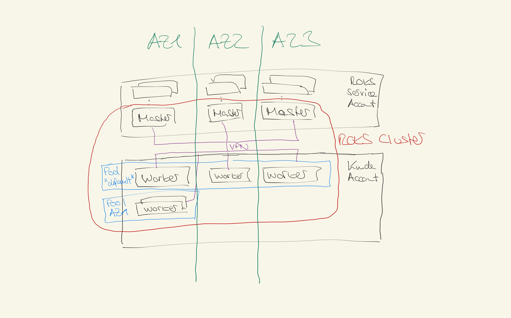

# Hochverfügbarkeit

Mit ROKS kann ein OpenShift-Cluster sehr einfach über die drei Rechenzentren (sog. Verfügbarkeitszonen/Availability Zones/AZ) einer sog. Multi-Zone-Region (MZR) in der IBM Cloud, z.B. in Frankfurt, verteilt werden.

Die OpenShift Master werden dabei IMMER hochverfügbar bereitgestellt, d.h. ich bekomme bei ROKS immer drei Master, die in einer MZR über alle drei AZs verteilt sind, auch wenn ich nur einen einzelnen Worker bestelle. 
Bei den Workern bestimme ich als Kunde über die Verfügbarkeit und Verteilung meiner Worker-Knoten, ich kann mich also entscheiden ob ich meine Woker über 1, 2 oder 3 Zonen innerhalb einer Region verteile und wie viele Worker ich in einer Zone bereitstellen will (idealerweise sollte man in allen Zonen gleich viele Worker vorsehen).

Eine regions-übergreifende Verteilung ist nicht direkt möglich, kann aber durch das Aufsetzen von zwei getrennten Clustern und einem davor geschaltenen globalen Loadbalancer realisiert werden (z.B. Cloud Internet Services in der IBM Cloud).
ROKS unterscheidet nicht zwischen Worker- und Infrastruktur-Knoten, es gibt nur Worker-Knoten (da viele der Infrastrukturaufgaben, z.B. Loadbalancing, Logging/Monitoring von entsprechenden Cloud-Services übernommen werden (können)). 

Die Master laufen in einem IBM Service Account, während die Worker im entsprechenden Kunden Cloud Account laufen (entweder auf der sog. Classic oder bevorzugt der Virtual Private Cloud (VPC) Infrastruktur). Die Kommunikation von den Mastern (die kunden- und cluster-dediziert aufgebaut sind) mit den Workern, zwischen den beiden Accounts, erfolgt über eine automatisch aufgesetzte VPN-Verbindung.

Inerhalb eines ROKS-Clusters können verschiedene Worker Pools gebildet werden. Beim Anlegen eines Clusters wird der sog. "default" Worker Pool erzeugt. 
Danach können weitere Worker Pools erstellt werden, z.B. zonenspezifisch (d.h. 1 Worker Pool pro Zone). Mit zonenspezifischen Worker Pools kann Workload relativ einfach in andere Zonen verschoben werden (z.B. für geplante Wartungen). 
Jeder Worker Pool kann über bis zu drei Zonen aufgespannt werden und besteht aus einer homogenen Knotengrösse (z.B. 4vCPU/16GB RAM). Die Anzahl der Knoten kann im Nachgang erweitert werden (auch automatisch über den sog. Cluster-Autoscaler). Wenn ein Worker Pool mehrere Zonen umfasst, dann ist die Knotenanzahl nur symmetrisch erweiterbar, d.h. in jeder Zone sind immer gleich viele Knoten in Bezug auf den Worker Pool.

Anbei mal ein Beispiel:
- Default Workerpool über 3 Zonen mit 1 Knoten: 1 Knoten AZ1, 1 Knoten AZ2, 1 Knoten AZ3 (bei einer Erweiterung wird immer mindestens um 3 Knoten erweitert, um die Knotenanzahl pro Zone symmetrisch zu halten)
- AZ1 Workerpool in AZ1 mit 1 Knoten: 1 Knoten AZ1 (bei einer Erweiterung kann um mindestens einen Knoten erweitert werden)
Jeder Workerpool kann dabei eine andere Worker-Knotengröße haben (verschiedene CPU/RAM Konfigurationen, oder auch Spezialfunktione mit GPU oder Intel SGX-Technologie für Machine Learning oder Confidential Workload).

Idealerweise sollte ein Workerpool über alle drei Zonen einer MZR aufgespannt werden. Damit ist gewährleistet, dass beim Ausfall einer Zone noch 2/3, also ca. 67% der Leistung (2 von 3 AZs noch verfügbar) vorhanden sind. Wenn ein Workerpool nur über zwei Zonen einer MZR aufgespannt wird ist beim Ausfall einer dieser Zonen nur noch eine Restkapazität von 50% vorhanden. D.h. ich kann beim Aufspannen über 3 Zonen kleinere Worker-Knoten wählen als bei einem Aufbau über 2 Zonen. Ein weiterer Aspekt, der das Aufspannen über drei Zonen erfordert ist der Einsatz von Softwarepaketen/Containern, die ein Quorum benötigen (oft auch Tiebreaker genannt, wird verwendet um "Split Brain" Szenarien zu verhindern). Solche Pakete benötigen zur hochverfügbaren Ausbringung eine Verteilung über drei Zonen, prominente Beispiele sind Kafka oder Elasticsearch, wenn man sie denn wirklich in seinem ROKS-Cluster selbst betreiben will (in der IBM Cloud gibt es hier als bevorzugte Alternative entsprechend bereits hochverfügbar aufgebaute PaaS-Services).

Weitere Hochverfügbarkeitsaspekte bzgl. Storage und Netzwerk (insbesondere auch Loadbalancing/Routing) schauen wir uns im Detail in den entsprechenden dedidzierten Blogeinträgen zu diesen Themen an.

**Zusammenfassung:** ROKS wird by default hochverfügbar bereitgestellt, d.h. die Master-Knoten werden in einer Multi-Zone-Region (z.B. Frankfurt) IMMER über drei Rechenzentren (sog. Availability Zones/AZ) verteilt. Bzgl. der Verteilung und Hochverfügbarkeit der Worker-Knoten kann der Kunde entscheiden wie viele Worker in welchen Zonen bereitgestellt werden, es wird empfohlen (und ist auch der default) möglichst alle drei Zonen einer MZR zu nutzen und eine symmetrische/gleiche Anzahl von Worker-Knoten pro AZ einzusetzen.

[Inhaltsverzeichnis](./README.md) 

Wichtige Links zum Thema:
-
