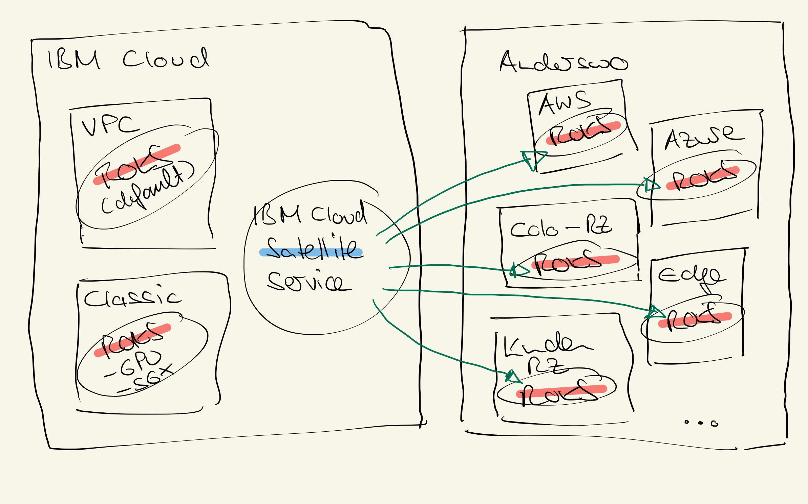

# Infrastrukturoptionen

Der Red Hat OpenShift Kubernetes Service (ROKS) kann in verschiedenen Infrastrukturen ausgerollt werden.
- IBM Cloud
  - Virtual Private Cloud (bevorzugt!!!)
  - Classic
- Anderswo (z.B. AWS, Azure, im eigenen Rechenzentrum, Edge, etc.)
  - IBM Cloud Satellite

Das Ausrollen auf der IBM Cloud sollte, wenn immer möglich, in der Virtual Private Cloud (VPC) - Umgebung erfolgen. Diese stellt eine moderne software-definierte Cloud-Infrastruktur bereit. 
In einigen Sondersituationen kann es jedoch (noch) erforderlich sein auf die Classic Infrastruktur, eine bewährte eher klassisch aufgebaute Cloud-Netzwerk-Infrastruktur, auszuweichen.  
Typische Beispiele für diese Sonderfälle sind:
- Nutzung von GPU Workern im Cluster (z.B. für Machine Learning)
- Nutzung von SGX Workern (data-in-memory Verschlüsselung mit DataShiel) für spezielle Confidential-Workload
- Nutzung von Bare Metal Workern (wenn striktere Isolierung erforderlich ist)

Diese Sonderfälle sind zum Zeitpunkt der Erstellung dieses Blogs noch nicht vollständig in VPC abbildbar, es ist aber davon auszugehen, dass sich dies in Zukunft ändert. 
In Classic und VPC werden jeweils nur die Worker-Knoten im Kundenaccount ausgebracht. Die Master-Knoten werden im ROKS-Service Account ausgebracht (dediziert pro Kunde/Cluster).

Neben diesen Möglichkeiten ROKS Cluster auf der IBM Cloud Infrastruktur zu deployen, existiert über IBM Cloud Satellite die Möglichkeit ROKS auch anderswo/überall auszurollen.
Unter "anderswo" kann dabei eine beliebige Linux-Infrastruktur, mit bestimmten Mindestanforderungen, und eine ausgehende Internetverbindung verstanden werden. 
Überall wo diese beiden Punkte (Linux-Infrastruktur & ausgehende Internetverbindung) bereitgestellt werden können, kann dann über Satellite ein (oder mehrere) ROKS Cluster ausgerollt werden, d.h. die Master und Worker laufen in diesem Fall entsprechend in dieser vom Kunden bereitgestellten Infrastruktur.
Typische Beispiele für solche Infrastrukturen wären: AWS, Azure, eigenes Kundenrechenzentrum, Edge-Lokationen (z.B. Warenhäuser, Lager, Fertigungsstrassen)). 
Der Hauptvorteil der Nutzung von ROKS liegt dabei in folgenden Aspekten:
1. Einheitlichkeit/Konsistenz - Der ROKS Service kann in all diesen Lokationen auf gleiche Art und Weise bereitgestellt werden (d.h. ich kann eine Entwicklungsumgebung in der Cloud betreiben, und Produktion in meinem RZ und habe keine Anpassungen)
2. Ge-Managedt - Ich brauche nur sehr wenig OpenShift Betriebs-Skills, da ROKS von Profis bereitgestellt und ge-managedt wird (d.h. sicher, hochverfügbar, unterbrechungsfreie/-arme Updates, etc.).
3. Die Daten und Applikationen bleiben in Kundenhoheit (das Cluster läüft ja im Satellite-Fall komplett auf vom Kunden bereitgestellter Infrastruktur)
acht.

**Zusammenfassung:** ROKS kann in der IBM Cloud und anderswo (über IBM Cloud Satellite) als ge-managedter Red Hat OpenShift Service bereitgestellt werden. In der IBM Cloud sollte, wann immer möglich die Virtual Private Cloud (VPC) Infrastruktur zum Ausrollen gewählt werden. 

[Inhaltsverzeichnis](./README.md) 

Wichtige Links zum Thema:
- [VPC & Classic - Supported Infrastructure Providers/Infrastrukturoptionen](https://cloud.ibm.com/docs/openshift?topic=openshift-infrastructure_providers)
- [Satellite - OpenShift Clusters in/mit Satellite](https://cloud.ibm.com/docs/openshift?topic=openshift-satellite-clusters)
