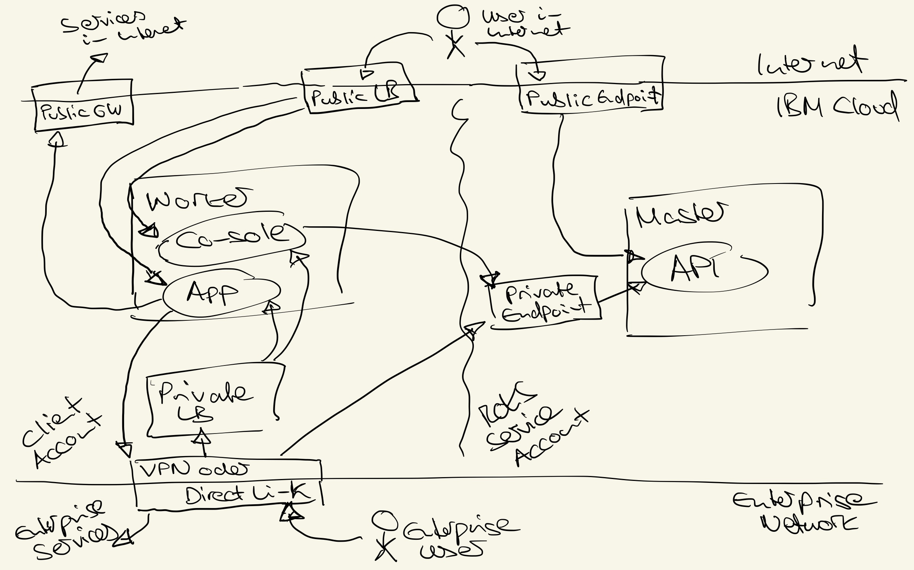
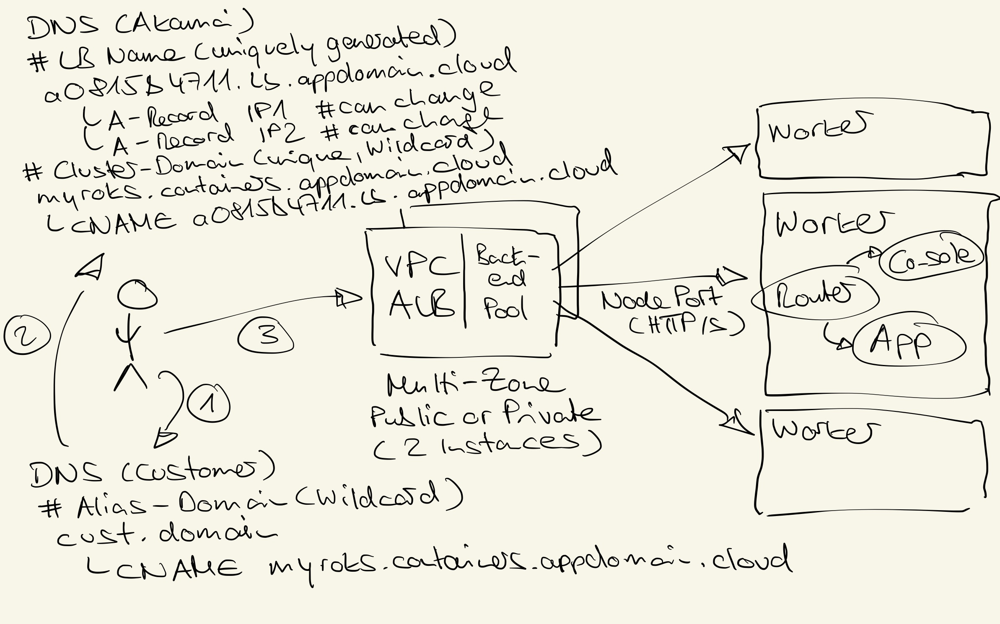

# Netzwerk

Generell kann ROKS mit privatem oder öffentlichem (public) Zugang, oder einer Mischung aus beidem ausgerollt werden. 
Dabei ist bzgl. Zugang zwischen zwei Ebenen zu unterscheiden:
- API Zugriff (sog. Public oder Private Endpoints/Endpunkte)
- Applikationszugriff (wird über Loadbalancer bereitgestellt)

Prinzipiell bedeutet privater Zugriff, dass ein Zugriff aus dem Internet nicht möglich ist, d.h. um auf das Cluster zugreifen zu können, muss man entweder im 
gleichen Netzwerk sein (z.B. durch Aufsetzen eines Jump-Servers oder Bastion-Nodes) oder über eine private Zugangstechnologie (z.B. VPN oder Direktverbindung/Direct Link) verfügen. 
Dies erhöht den Administrationsaufwand und die Sicherheit gleichermassen. Für die allermeisten Cluster (Spielcluster und PoCs ausgenommen) ist es m.E. deshalb sinnvoll
den Zugriff zunächst auf private Endpunkte und private Loadbalancer zu begrenzen und bei Bedarf um public/öffentliche Loadbalancer, für die Applikationsteile, die ins Internet exponiert werden müssen, zu erweitern.

Diese Empfehlungen beziehen sich explizit auf "Zugang", d.h. eingehenden Datenverkehr (oft auch als Inbound Traffic bezeichnet). 
Ausgehende Requests ins Internet (z.B. zum Pullen eines Container-Images, sog. Outbound Traffic) können separat davon betrachtet werden und z.B. in einer Virtual Private Cloud (VPC)-Umgebung separat davon über ein Public Gateway ermöglicht werden.

Als Loadbalancer für den Applikationszugriff stehen Application Load Balancer (ALB) oder Network Load Balancer (NLB) zur Verfügung. Beide können privat oder öffentlich/public bereitgestellt werden. Die folgenden Ausführungen beziehen sich auf eine Bereitstellung in einer VPC-Umgebung (für Bereitstellung in einer Classic- oder IBM Cloud Satellite-Umgebung sind die Mechanismen ähnlich, können aber im Detail etwas abweichen).
- VPC ALB 
  - Default, d.h. bei der Bereitstellung eines ROKS Clusters wird auch immer ein VPC ALB provisioniert. Weitere VPC ALBs (public und/oder private) können erzeugt werden
  - Ein VPC ALB wird in einer Multi-Zonen-Region (MZR) immer in mehreren Zonen/Rechenzentren, also hochverfügbar, bereitgestellt (zwei) Instanzen)
  - Die IP-Addressen der (zwei) VPC ALB Instanzen eines Clusters werden als Aliase bei einem clusterspezifisch automatisch angelegten DNS-Eintrag für eine Wildcard-Domäne hinterlegt (bei Akamai)
  - Die IP Adresse einer einzelnen VPC ALB Instanz kann sich ändern (z.B. wenn die Instanz in eine andere Zone verschoben werden muss), dann wird automatisch der DNS-Eintrag ge-updatet. D.h. Applikationen sollten hier nicht mit IP-Adressen, sondern mit entsprechenden FQDNs arbeiten (Fully Qualified Domain Names, vollqualifizierten Hostnamen incl. Domäne).
  - Der ALB kann Requests auf Layer 4 (TCP-Protokoll) oder Layer 7 (z.B. HTTP/S-Protokoll) lastverteilen (quasi als Reverse Proxy)
- VPC NLB
  - Kann erzeugt werden (kein Default)
  - Ein VPC NLB wird zonenspezifisch erzeugt, d.h. wenn man hier ein MZR-Loadbalancing erreichen will, muss man sich selber um entsprechende Konfiguration eines DNS-Servers kümmern.
  - Die IP Adresse eines VPC NLB ist statisch/fix (aber innerhalb der Zone trotzdem hochverfügbar)
  - Der NLB kann Requests auf Layer 4 (TCP-Protokoll) verteilen und hat den Vorteil, dass er DSR (Direct Server Return) untersützt, d.h. Responses müssen nicht wieder durch den Loadbalancer hindurch.

Hinter dem VPC Loadbalancer (NLB oder ALB) hängt der entsprechende Ingress-Controll (Default-Router) in ROKS. D.h. in den sogenannten Backend-Pools des jeweiligen Loadbalancers sind die ROKS Worker aufgelistet und standardmässig der HTTP und HTTPS-Port aufgeführt (als Nodeport) unter dem der Default-Router (Service) läuft.

Am Beispiel des VPC ALB will ich nochmal exemplarisch den Ablauf eines Requests schildern:
1. Der Benutzer gibt eine entsprechende kundenspezifische URL in seinen Browser ein (z.B. console.cust.domain). Mit dem Hostnamen dieser URL erfolgt ein Lookup gegen einen entsprechenden Kunden-DNS-Server. In diesem Server ist ein Alias (sog. CNAME) vom kundenspezifischen Hostnamen/Domain auf die sog. Cluster-Domain hinterlegt, die bei der Anlage eines Clusters und/oder Loadbalancers generiert wird
2. Diese Cluster-Domain ist entsprechend per Alias (CNAME) auf einen Loadbalancer gemappt. Hinter dem Loadbalancer-Eintrag verbergen sich die entsprechenden IP-Adressen des Loadbalancers (bei VPC ALBs sind dies typischerweise zwei IP-Adressen in unterschiedlichen Zonen). Diese IP-Adressen können sich ändern (wenn z.B. ein Loadbalancer in eine andere Zone verschoben werden muss), sollten deshalb also nicht direkt referenziert werden. Bei einer Änderung der IP-Adressen werden die entsprechenden DNS-Einträge automatisch angepasst.
3. Mit einer der hinterlegten IP-Adressen erfolgt nun der Aufruf gegen den Loadbalancer. Dieser leitet den Request an seinen Backend-Pool weiter. Hier sind standardmässig alle Worker-Knoten eines Clusters hinterlegt mit den entsprechenden Node-Ports des Routers (für HTTP und HTTPS). Am Router wird dann anhand der URL die entsprechende Applikation angesprochen.

**Zusammenfassung:** Mit ROKS kann der Administrationszugang (sog. Endpoints) und Applikationszugang (sog. Loadbalancer) auf privaten Netzwerk-Zugang beschränkt werden. Dies erhöht den Administrationsaufwand zwar etwas (da eine private Zugangslösung, z.B. VPN/Directverbindung, Bastion Host oder Sprungserver benötigt wird) erhöht aber auch die Sicherheit deutlich. Bei Bedarf können dann für die Applikationsteile, die ins Internet exponiert werden müssen, öffentliche/public Loadbalancer hinzukonfiguriert werden.

[Inhaltsverzeichnis](./README.md)

Wichtige Links zum Thema:
- [Red Hat OpenShift on IBM Cloud Architecture](https://cloud.ibm.com/docs/openshift?topic=openshift-service-arch) 
Provides a detailed view of the connectivity in different setups (Classic and VPC, Public and Private)
