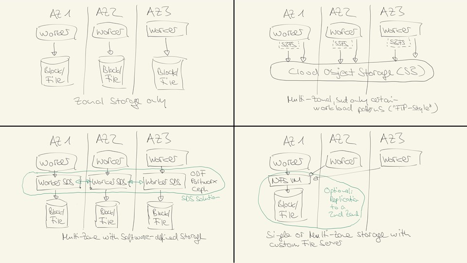

# Storage

Persistenter Speicherplatz für Workload kann in ROKS auf verschiedene Arten und Weisen bereitgestellt werden. Bevor wir uns die verschiedenen Möglichkeiten zur Speicherbereitstellung in einem ROKS Cluster anschauen noch eine Vorbemerkung: Falls möglich sollte das Speichern von persistenten Information in Datenbanken und Logwerkzeugen in der Cloud (PaaS-Services) erfolgen und nicht im Cluster selbst. Kubernetes (Containertechnologie) ist prädestiniert für zustandslose Workload, zustandsbehaftete Workload hat oft ihre Tücken (auch und gerade, wenn noch Betriebsthemen, wie Backup/Restore/Cleanup/Monitoring hinzukommen).

Abhängig von den Workloadmustern und den Verfügbarkeitsanforderungen existieren verschiedene Möglichkeiten persistenten Speicherplatz für Container in ROKS abzubilden:
- **Zonaler File- oder Blockstorage** 
  File- (NAS-Storage, NFS) oder Blockstorage (SAN-Storage, Fibre) in diversen Geschwindigkeiten (sog. IOPS, je disk-intensiver die Workload desto höher sollte die Anzahl IOPS gewählt werden) ist direkt als Service aus der Cloud buchbar und in ein Cluster sehr einfach (über UI oder API) integrierbar.
- **Multi-Zonaler Cloud Object Storage (S3-API)** 
  Cloud Object Storage (COS) ist direkt als Service aus der Cloud buchbar und über mehrere Zonen einer Region (sogar über mehrere Regionen hinweg, falls benötigt) verfügbar. Der Storage kann entweder über S3-API direkt aus einer Anwendung angesprochen werden, oder über einen entsprechenden Dateitreiber (z.B. s3fs) als Dateisystem in einen Container eingebunden werden. COS ist aufgrund seiner Natur allerdings ein Speicher, der für bestimmte Zugriffsmuster geeigneter ist ("FTP"-Style, also eher Datei erzeugen und holen) als für andere (z.B. ständige Updates derselben Datei, Locking-Erfodernisse und konkurrierender Zugriff).
- **Multi-Zonaler Software-Defined-Storage (SDS)** 
  Software-definierter-Storage stellt einen Abstraktionslayer zur Verfügung, mit dessen Hilfe den Containern zonenübergreifender Speicher mit verschiedenen Technologie-Interfaces (Block, File, S3) zur Verfügung gestellt werden können. Für ROKS werden in der IBM Cloud zwei SDS-Technologien zur Verfügung gestellt 
  - OpenShift Data Foundation (ehemals OCS, OpenShift Container Storage)
  - Portworx 
- **Eigen-verwalteter externer Fileserver** 
Eigene externe Fileserver können zonal oder multi-zonal auf VMs (sog. Virtual Server Instanzen / VSIs) aufgebaut und durch den Kunden selbstverwaltet werden (z.B. NFS-Server).

Ein weiterer Vorteil von software-defininiertem Speicher, insbesondere in der OpenShift-eigenen Variante ODF, liegt in der Portabilität. Ein Nachteil ist, dass meist zusätzliche Worker zur Bereitstellung des SDS-Layers benötigt werden und zusätzliche Subscription/Lizenz-Kosten anfallen (im Vergleich zu "normalem" Block-, File- oder S3-Storage).

**Zusammenfassung:** Anwendungen sollten, wo möglich die hochverfügbaren PaaS Services aus der Cloud verwenden (z.B. Datenbanken, Logging). Persistenter Speicher für zustandsbehaftete Workload kann in ROKS auf verschiedenste Arten und Weisen zonal oder multi-zonal bereitgestellt werden. Sollte Hochverfügbarkeit benötigt werden sollte ein zonenübergreifender Storage verwendet werden. Für FTP-style (put, get) workload kann hier Cloud Object Storage (S3) verwendet werden, für Workload die häufige Dateiänderungen erfordert sollte ein software-definierter Storage zum Einsatz kommen (z.B. mit OpenShift Data Foundation/ODF aka OpenShift Container Storage/OCS).

[Inhaltsverzeichnis](./README.md) 

Wichtige Links zum Thema:
- File and Block
  - [ROKS - IBM Cloud storage utilities](https://cloud.ibm.com/docs/openshift?topic=openshift-utilities)
  - Classic
    - [ROKS - Storing data on classic IBM Cloud File Storage](https://cloud.ibm.com/docs/openshift?topic=openshift-file_storage)
    - [ROKS - Storing data on classic IBM Cloud Block Storage](https://cloud.ibm.com/docs/openshift?topic=openshift-block_storage)
  - VPC
    - [ROKS - Storing data on Block Storage for VPC](https://cloud.ibm.com/docs/openshift?topic=openshift-vpc-block)
- Cloud Object Storage
  - [ROKS - Storing data on IBM Cloud Object Storage](https://cloud.ibm.com/docs/openshift?topic=openshift-object_storage)
- Software-Defined-Storage (SDS)
  - ODF
    - [ROKS - Deploying OpenShift Data Foundation on Classic clusters](https://cloud.ibm.com/docs/openshift?topic=openshift-deploy-odf-classic) 
    - [ROKS - Deploying OpenShift Data Foundation on VPC clusters](https://cloud.ibm.com/docs/openshift?topic=openshift-deploy-odf-vpc) 
    - [ROKS - Deploying an app on OpenShift Data Foundation](https://cloud.ibm.com/docs/openshift?topic=openshift-odf-deploy-app)
  - Portworx
    - [Portworx on IBM Cloud](https://docs.portworx.com/portworx-install-with-kubernetes/cloud/ibm/)
    - [ROKS - Storing data on software-defined storage (SDS) with Portworx](https://cloud.ibm.com/docs/openshift?topic=openshift-portworx)
 
 
